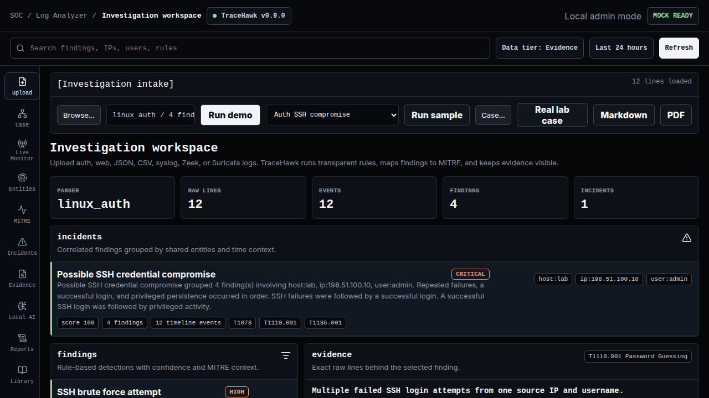
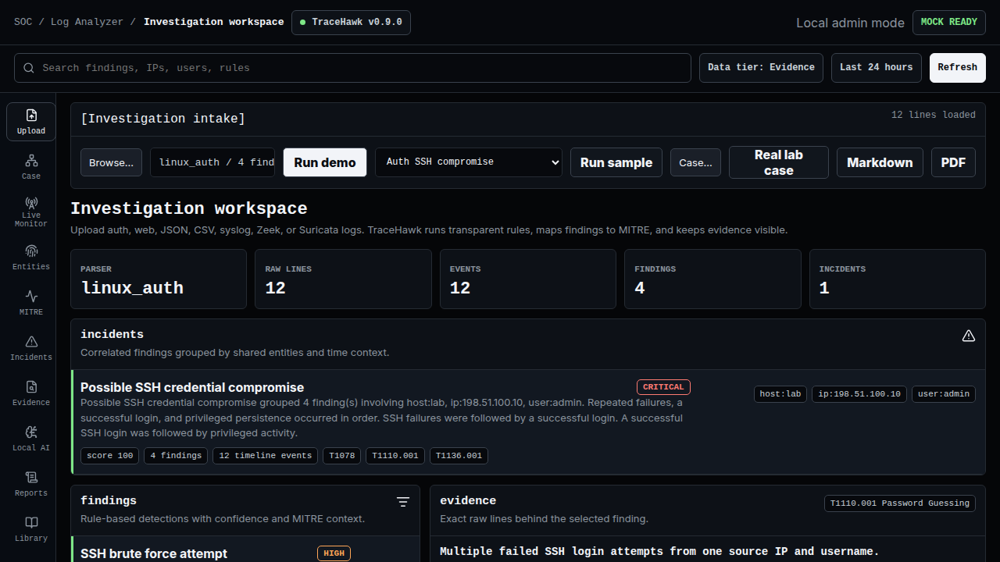
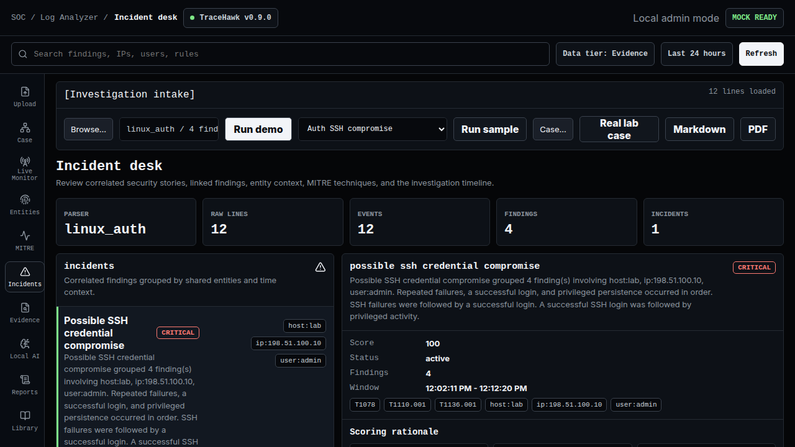
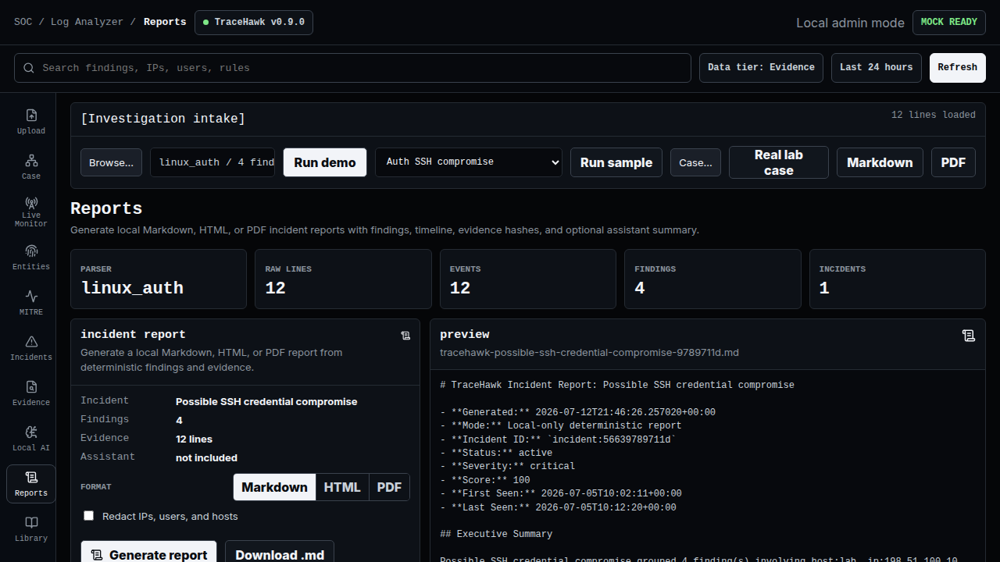

# TraceHawk — Security Log Analyzer

[](https://github.com/0zB0/Security-Log-Analyzer/actions/workflows/ci.yml)
[](https://github.com/0zB0/Security-Log-Analyzer/releases)
[](apps/api/pyproject.toml)
[](LICENSE)

TraceHawk is a local-first, evidence-first security log analyzer for homelabs and small teams. It
turns Linux, cloud, container, Windows, Zeek, and Suricata telemetry into deterministic findings,
correlated incidents, line-level evidence, MITRE ATT&CK context, and analyst reports.

Detection authority remains in transparent YAML rules. Optional local Ollama explanations are
grounded in selected evidence and cannot create or alter findings.

[Portfolio](https://ozbejbohanec.com) ·
[Documentation](docs/README.md) ·
[Engineering guide](docs/engineering-portfolio-guide.md) ·
[AI disclosure](docs/ai-assisted-development.md) ·
[Threat model](docs/threat-model.md) ·
[Limitations](docs/limitations.md)



## What The Demo Proves

| Capability | Public evidence |
| --- | --- |
| Ingest | Linux auth, web, syslog, JSON, CSV, CloudTrail, Kubernetes audit, Windows Security, Zeek, Suricata, Docker, approved interface metadata, and opt-in bounded TCP/UDP syslog |
| Parser routing | Stratified confidence ranking plus per-line mixed-log routing with parser provenance |
| Detection | 66 YAML rules, 2–8 step typed sequences, MITRE mapping, evidence hashes, and benign controls |
| Correlation | Declarative behavior patterns, strict common-entity/time bounds, and independent-source scoring with visible rationale |
| Validation | Role-separated IoT-23 scan and C2-indicator metrics with per-capture errors and uncertainty |
| Resource safety | Bounded request, upload, live rolling window, collector line/queue/connection/batch, rate, and performance budgets |
| Access control | Explicit local/deployed trust modes, viewer/analyst/admin RBAC, WebSocket gate, and audit trail |
| Reports | Markdown, HTML, and PDF with scoring rationale, evidence, hashes, optional redaction, and no cloud dependency |

## 30-Second Product Tour

### 1. Load a bounded sample or upload



### 2. Inspect the correlated incident and raw evidence



### 3. Export an analyst report



Open the committed proof report:

- [sample incident HTML](docs/assets/reports/tracehawk-sample-incident.html)
- [sample incident PDF](docs/assets/reports/tracehawk-sample-incident.pdf)
- [multi-source incident case study](docs/case-study-real-lab.md)

## Run This In 2 Minutes

Requirements: Docker Engine with Compose v2.

```bash
git clone https://github.com/0zB0/Security-Log-Analyzer.git
cd Security-Log-Analyzer
docker compose --profile production up --build
```

Open `http://localhost:8000`, click **Real lab case**, then open **Incidents**, **Evidence**, or
**Reports**. Local Docker mode runs without external authentication and without a cloud LLM. The
committed Compose file therefore publishes the service on `127.0.0.1` only.

Stop the container while keeping the named SQLite volume:

```bash
docker compose --profile production down
```

## Architecture


Active stack:

- `apps/api`: FastAPI, SQLAlchemy, deterministic parsing, detection, correlation, and reports;
- `apps/web`: React, TypeScript, and Vite investigation workspace;
- `packages/rules`: versioned YAML detection content;
- `packages/correlation`: versioned multi-rule behavior patterns;
- `packages/sample-data` and `packages/test-scenarios`: sanitized reproducible evidence;
- `tools`: public quality, performance, smoke, and recovery gates.

Detailed design: [architecture](docs/architecture.md) and
[local SOC assistant blueprint](local-soc-assistant-architecture.md).
Critical decisions are recorded in [ADRs](docs/adr/), with an executable
[technical walkthrough](docs/technical-walkthrough.md).

## Local Development And Verification

```bash
python3 -m venv .venv
.venv/bin/python -m pip install --upgrade pip==26.1.2
.venv/bin/python -m pip install --constraint apps/api/requirements.lock -e 'apps/api[dev]'
npm --prefix apps/web ci
make verify-all
```

The public gate covers more than 200 backend tests, end-to-end rule scenarios, all 66 rule
contracts, deterministic API-contract drift, performance budgets, whole-source frontend coverage,
Docker Compose validation, live analysis, local AI fallback, report generation, component/axe
tests, and five Playwright browser workflows. GitHub Actions additionally runs Gitleaks, Semgrep,
dependency audits, a pinned-action build, and a Trivy container scan.

Useful commands:

```bash
make api-dev
make web-dev
make benchmark
make detection-quality-check
make security-scan
```

Contract generation and drift rules are documented in the
[generated API contract guide](docs/api-contract.md).

## Security And Scope

TraceHawk is a single-replica, local-first portfolio system, not a multi-tenant SIEM. Do not upload
production logs, credentials, client data, internal topology, or confidential evidence. The local
mode is intended for sanitized evaluation data and binds to loopback by default.

Read before deployment or evaluation:

- [security controls](docs/security.md)
- [threat model](docs/threat-model.md)
- [auth and RBAC matrix](docs/auth-rbac.md)
- [operational boundaries](docs/operations.md)
- [detection quality and IoT-23 error analysis](docs/detection-quality.md)
- [performance method and budgets](docs/performance.md)

## Development Transparency

TraceHawk was built with extensive generative AI assistance. The maintainer estimates that
approximately 99% of the implementation code was initially generated or drafted by AI, then
reviewed, tested, debugged, and accepted under human responsibility. The contribution is the
demonstrated understanding of the architecture, security boundaries, tests, tradeoffs, and
limitations—not a claim that every line was typed manually.

Read the full [AI-assisted development disclosure](docs/ai-assisted-development.md).

## Public Repository Boundary

This repository is a curated public release containing the runnable product, tests, sanitized
fixtures, public evidence, and release assets. Private deployment configuration, internal CI/CD,
historical operational records, and non-public infrastructure details are intentionally omitted.
`PUBLIC_EXPORT.json` records the allowlisted export receipt for the published revision.

## License

[MIT](LICENSE). Detection rules and sanitized demo artifacts are included under the same repository
license unless a dataset note states an external source and its own terms.
