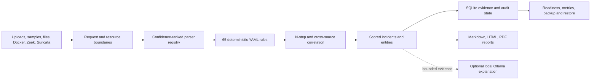

# TraceHawk

[](https://github.com/0zB0/Security-Log-Analyzer/actions/workflows/ci.yml)
[](https://github.com/0zB0/Security-Log-Analyzer/releases)
[](apps/api/pyproject.toml)
[](LICENSE)

Evidence-first SOC investigation for local logs and multi-source Zeek/Suricata cases. TraceHawk
parses heterogeneous security logs, runs 65 transparent YAML rules, correlates findings into scored
incidents, preserves line-level evidence, maps MITRE ATT&CK context, and exports analyst reports.
Detections stay deterministic; the optional local Ollama layer can explain but never create or
change findings.

[Live protected demo](https://ca-security-log-analyzer.bluebush-2bdd630a.germanywestcentral.azurecontainerapps.io/) ·
[Portfolio](https://ozbejbohanec.com) ·
[Threat model](docs/threat-model.md) ·
[Limitations](docs/limitations.md)


## What The Demo Proves

| Capability | Public evidence |
| --- | --- |
| Ingest | Linux auth, web, syslog, JSON, CSV, CloudTrail, Kubernetes audit, Windows Security, Zeek, Suricata, Docker, and approved interface metadata |
| Parser routing | Stratified confidence ranking plus per-line mixed-log routing with parser provenance |
| Detection | 65 YAML rules, 2–8 step typed sequences, MITRE mapping, evidence hashes, and benign controls |
| Correlation | Entity, timing, sequence, rule-family, and independent-source scoring with visible rationale |
| Validation | Sanitized scenarios plus IoT-23 precision, recall, false-positive, and false-negative notes |
| Resource safety | Bounded request, file, line, file-count, total-bundle, rate, and performance budgets |
| Access control | Explicit local/deployed trust modes, viewer/analyst/admin RBAC, WebSocket gate, and audit trail |
| Reports | Markdown, HTML, and PDF with scoring rationale, evidence, hashes, optional redaction, and no cloud dependency |

## 30-Second Product Tour

### 1. Load a bounded sample or upload


### 2. Inspect the correlated incident and raw evidence


### 3. Export an analyst report


Open the committed proof report:

- [sample incident HTML](docs/assets/reports/tracehawk-sample-incident.html)
- [sample incident PDF](docs/assets/reports/tracehawk-sample-incident.pdf)
- [multi-source incident case study](docs/case-study-real-lab.md)

## Run This In 2 Minutes

Requirements: Docker Engine with Compose v2.

```bash
git clone https://github.com/0zB0/Security-Log-Analyzer.git
cd Security-Log-Analyzer
docker compose --profile production up --build
```

Open `http://localhost:8000`, click **Real lab case**, then open **Incidents**, **Evidence**, or
**Reports**. Local Docker mode runs without external authentication and without a cloud LLM. The
committed Compose file therefore publishes the service on `127.0.0.1` only.

Stop the container while keeping the named SQLite volume:

```bash
docker compose --profile production down
```

## Architecture



Active stack:

- `apps/api`: FastAPI, SQLAlchemy, deterministic parsing, detection, correlation, and reports;
- `apps/web`: React, TypeScript, and Vite investigation workspace;
- `packages/rules`: versioned YAML detection content;
- `packages/sample-data` and `packages/test-scenarios`: sanitized reproducible evidence;
- `tools`: public quality, performance, smoke, and recovery gates.

Detailed design: [architecture](docs/architecture.md) and
[local SOC assistant blueprint](local-soc-assistant-architecture.md).
Critical decisions are recorded in [ADRs](docs/adr/), with an executable
[technical walkthrough](docs/technical-walkthrough.md).

## Local Development And Verification

```bash
python3 -m venv .venv
.venv/bin/python -m pip install --upgrade pip==26.1.2
.venv/bin/python -m pip install --constraint apps/api/requirements.lock -e 'apps/api[dev]'
npm --prefix apps/web ci
make verify-all
```

The public gate covers backend tests, end-to-end rule scenarios, all 65 rule contracts,
performance budgets, web build, Docker Compose validation, live analysis, local AI fallback,
report generation, and UI smoke. GitHub Actions additionally runs Gitleaks, Semgrep, dependency
audits, and a Docker build.

Useful commands:

```bash
make api-dev
make web-dev
make benchmark
make detection-quality-check
make security-scan
```

## Security And Scope

TraceHawk is a single-replica, local-first portfolio system, not a multi-tenant SIEM. Do not upload
production logs, credentials, client data, internal topology, or confidential evidence. The hosted
demo is protected; local mode is intended for sanitized evaluation data.

Read before deployment or evaluation:

- [security controls](docs/security.md)
- [threat model](docs/threat-model.md)
- [auth and RBAC matrix](docs/auth-rbac.md)
- [operational boundaries](docs/operations.md)
- [detection quality and IoT-23 error analysis](docs/detection-quality.md)
- [performance method and budgets](docs/performance.md)

## Public Repository Boundary

This repository is a curated public release containing the runnable product, tests, sanitized
fixtures, public evidence, and release assets. Private deployment configuration, internal CI/CD,
historical operational records, and non-public infrastructure details are intentionally omitted.
`PUBLIC_EXPORT.json` records the allowlisted export receipt for the published revision.

## License

[MIT](LICENSE). Detection rules and sanitized demo artifacts are included under the same repository
license unless a dataset note states an external source and its own terms.
