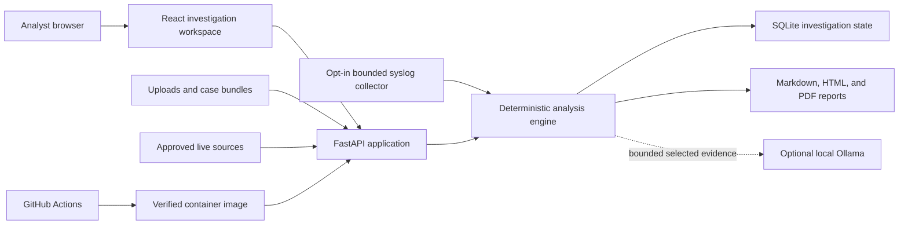
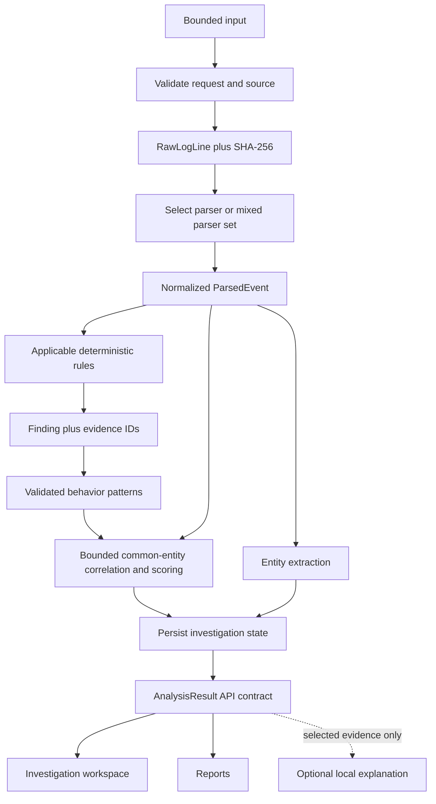
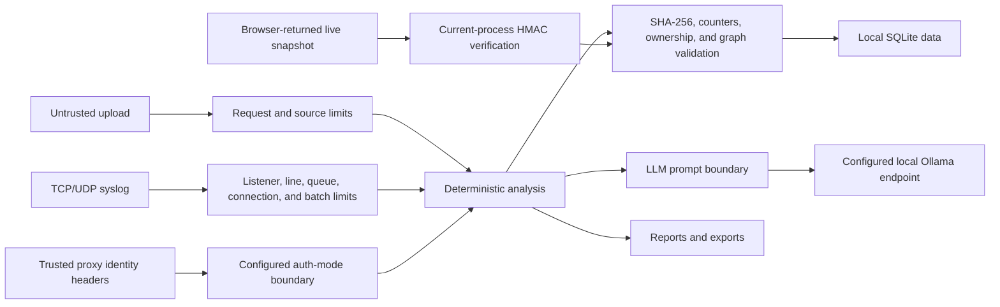

# TraceHawk Architecture

> Audience: engineers, security reviewers, and operators
> Canonical for: system components, boundaries, core objects, and architectural invariants
> Verified against: TraceHawk v0.10.0

TraceHawk is a single-replica, local-first investigation service. It accepts bounded logs or
lightweight telemetry, produces deterministic findings, correlates them into explainable incidents,
persists investigation state in SQLite, and renders analyst-facing views and reports.

Detailed stage behavior belongs in the [event-processing pipeline](event-processing-pipeline.md),
stored-data behavior in the [persistence lifecycle](persistence-evidence-lifecycle.md), and React
structure in the [frontend architecture](frontend-architecture.md).

## System Context



The public repository targets the loopback-bound Docker profile. It runs without external
authentication or a cloud LLM. Optional proxy-auth mode requires a trusted header-sanitizing
identity boundary and explicit application allowlists.

## Component View

| Component | Responsibility | Primary location |
| --- | --- | --- |
| React workspace | Intake, navigation, investigation views, reports, and live status | `apps/web/src/` |
| API and authorization | HTTP/WebSocket boundary, role enforcement, request lifecycle | `apps/api/tracehawk_api/main.py`, `routers/`, `auth.py` |
| Upload boundary | Extension, size, line, encoding, bundle, and rate limits | `services/uploads.py`, `security.py` |
| Collector boundary | Loopback-default TCP/UDP, line, queue, connection, idle, and batch limits | `collector.py`, `services/syslog_collector.py` |
| Parser layer | Confidence-ranked parser selection and normalized events | `services/parser_registry.py`, parser modules |
| Detection engine | Deterministic YAML rule evaluation and evidence-backed findings | `services/rules.py`, `services/detection.py`, `packages/rules/` |
| Correlation layer | Bounded common-entity grouping plus declarative pattern scoring | `services/correlation.py`, `services/correlation_patterns.py`, `packages/correlation/` |
| Persistence layer | Saved analyses, events, findings, incidents, entities, notes, settings, audit | `database.py`, `services/persistence.py` |
| Report layer | Markdown, HTML, PDF, and optional redaction | `services/reports/` |
| Assistant layer | Evidence-bounded prompt construction and local explanation | `services/llm.py`, `routers/assistant.py` |
| Operations layer | Logs, metrics, readiness, backup, retention, and deployment proof | `observability.py`, operations services and tools |

## Main Data Flow



## Core Domain Objects

```text
AnalysisResult
├── SourceSummary[]
├── ParsedEvent[]
│   └── raw_line_id + normalized parser provenance
├── Finding[]
│   ├── rule_id
│   ├── severity and confidence
│   ├── evidence_line_ids[]
│   └── MITRE mapping
├── Incident[]
│   ├── finding_ids[]
│   ├── entities[]
│   ├── score_breakdown
│   └── score_rationale[]
├── Entity[]
├── EvidenceLine[]
├── CrossSourceLink[]
├── LiveRetentionSummary
├── EvidenceIntegritySummary
└── CaseQualitySummary
```

Pydantic models in `apps/api/tracehawk_api/models/domain.py` define the shared backend contract.
The deterministic [generated API contract](api-contract.md) exports their OpenAPI component schemas
to TypeScript; `apps/web/src/lib/api.ts` consumes those generated core response types.

## Trust Boundaries



The [threat model](threat-model.md) owns abuse cases and security invariants. Important architectural
boundaries are:

- input is untrusted until validated and parsed;
- a live snapshot is untrusted when it returns from the browser until its process-local HMAC,
  hashes, counters, and graph references are verified;
- proxy identity headers are ignored in local mode and trusted only in explicit proxy-auth mode;
- uploaded original files are not retained as files;
- persisted raw evidence text is sensitive local data;
- LLM input is a bounded projection of already selected evidence;
- AI output never enters the detection authority path;
- exported reports may require redaction before sharing.

## Architectural Invariants

1. A finding is created only by deterministic detection code.
2. Every finding retains evidence identifiers that resolve to raw input lines.
3. Parser provenance survives normalization, including mixed input.
4. Incident scores expose their components and human-readable rationale.
5. Optional AI cannot mutate events, findings, incidents, evidence, or scores.
6. Request and live-source limits are enforced before unbounded work.
7. Public-demo inputs and committed fixtures remain sanitized.
8. Current deployment remains single-replica until state, rate limiting, audit, and migrations are
   designed for horizontal operation.
9. Every unpurged stored raw line passes server-side SHA-256 verification before commit.
10. Live snapshot attestation proves current-process snapshot integrity, not source-host identity.
11. Incident groups retain one stable entity common to every finding and never expand through a
    transitive entity bridge.
12. Correlation behavior comes from validated rule metadata and versioned patterns, never from
    concrete rule IDs or title fragments.
13. Live source state cannot exceed configured raw-line and parsed-event capacities; drop counters
    are signed and saved with bounded-window provenance.
14. Syslog listeners are opt-in, loopback-default, queue-bounded, and absent from Azure.

## Deployment Shapes

### Local production profile

The root Docker image builds the web bundle and serves the complete application through one
FastAPI container. A named volume stores SQLite state. Ports bind to loopback by default.

### Split development profile

FastAPI and Vite run as separate services. The web app calls the configured API base URL.

### GitHub release path

```text
GitHub pull request or main push
→ tests, coverage, Playwright, Gitleaks, Semgrep, and dependency audits
→ digest-pinned container build
→ Trivy HIGH/CRITICAL image gate
→ clean allowlisted public export receipt
```

The supported public deployment path is documented in
[self-hosted deployment](deployment-selfhost.md).

## Key Decisions

- [ADR 0001: confidence-ranked parser routing](adr/0001-confidence-ranked-parser-routing.md)
- [ADR 0002: transparent additive correlation scoring](adr/0002-transparent-correlation-scoring.md)
- [ADR 0003: LLM explanation outside detection authority](adr/0003-llm-explanation-boundary.md)

## Verification Map

| Architectural claim | Implementation | Verification |
| --- | --- | --- |
| Specific parsers outrank generic fallbacks | `services/analysis.py`, `parser_registry.py` | `test_parser_selection.py` |
| Findings retain raw evidence | `services/detection.py`, `analysis.py` | parser pipeline and scenario tests |
| Correlation is declarative and bounded | `services/correlation.py`, `services/correlation_patterns.py` | `test_correlation_patterns.py`, `test_correlation_scoring.py` |
| Saved runs can be reopened | `database.py`, `persistence.py` | `test_analyze_api.py` |
| AI is evidence-bounded | `services/llm.py` | `test_assistant_api.py` |
| Authorization gates HTTP and WebSocket paths | `auth.py`, routers | `test_auth_gate.py` |
| Reports preserve core fields and redaction | `services/reports/` | `test_reports_api.py`, `test_case_bundle_api.py` |

Run the executable review path in the [technical walkthrough](technical-walkthrough.md).

## Limitations

The architecture deliberately does not include a distributed log store, collector fleet,
multi-tenant isolation, centralized rate limiter, immutable external audit sink, automated response,
or tenant-aware immutable evidence ledger. Alembic manages the SQLite schema, including strict
recognition of the pre-versioned baseline and the v0.8.0 case-integrity migration. See
[current limitations](limitations.md) before treating the system as more than a bounded local or
portfolio deployment.
