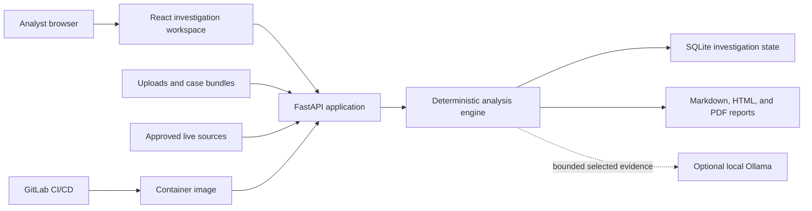
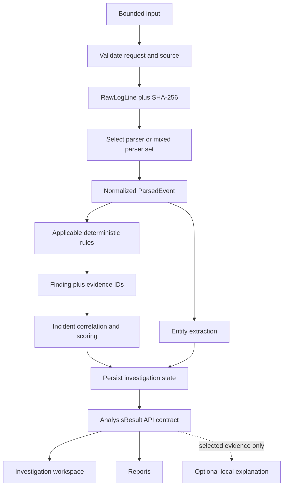
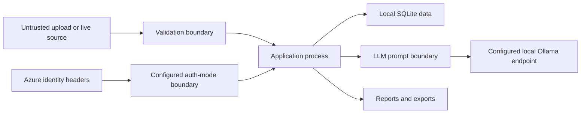

# TraceHawk Architecture

> Audience: engineers, security reviewers, and operators
> Canonical for: system components, boundaries, core objects, and architectural invariants
> Verified against: TraceHawk v0.7.1

TraceHawk is a single-replica, local-first investigation service. It accepts bounded logs or
lightweight telemetry, produces deterministic findings, correlates them into explainable incidents,
persists investigation state in SQLite, and renders analyst-facing views and reports.

Detailed stage behavior belongs in the [event-processing pipeline](event-processing-pipeline.md),
stored-data behavior in the [persistence lifecycle](persistence-evidence-lifecycle.md), and React
structure in the [frontend architecture](frontend-architecture.md).

## System Context



The public Azure deployment and local Docker deployment use the same application image. Local mode
can run without external authentication or a cloud LLM. Azure mode uses its configured identity
boundary and application allowlists.

## Component View

| Component | Responsibility | Primary location |
| --- | --- | --- |
| React workspace | Intake, navigation, investigation views, reports, and live status | `apps/web/src/` |
| API and authorization | HTTP/WebSocket boundary, role enforcement, request lifecycle | `apps/api/tracehawk_api/main.py`, `routers/`, `auth.py` |
| Upload boundary | Extension, size, line, encoding, bundle, and rate limits | `services/uploads.py`, `security.py` |
| Parser layer | Confidence-ranked parser selection and normalized events | `services/parser_registry.py`, parser modules |
| Detection engine | Deterministic YAML rule evaluation and evidence-backed findings | `services/rules.py`, `services/detection.py`, `packages/rules/` |
| Correlation layer | Incident grouping, sequence context, score, and rationale | `services/correlation.py`, `services/case_bundle.py` |
| Persistence layer | Saved analyses, events, findings, incidents, entities, notes, settings, audit | `database.py`, `services/persistence.py` |
| Report layer | Markdown, HTML, PDF, and optional redaction | `services/reports/` |
| Assistant layer | Evidence-bounded prompt construction and local explanation | `services/llm.py`, `routers/assistant.py` |
| Operations layer | Logs, metrics, readiness, backup, retention, and deployment proof | `observability.py`, operations services and tools |

## Main Data Flow



## Core Domain Objects

```text
AnalysisResult
├── SourceSummary[]
├── ParsedEvent[]
│   └── raw_line_id + normalized parser provenance
├── Finding[]
│   ├── rule_id
│   ├── severity and confidence
│   ├── evidence_line_ids[]
│   └── MITRE mapping
├── Incident[]
│   ├── finding_ids[]
│   ├── entities[]
│   ├── score_breakdown
│   └── score_rationale[]
├── Entity[]
├── EvidenceLine[]
├── CrossSourceLink[]
└── CaseQualitySummary
```

Pydantic models in `apps/api/tracehawk_api/models/domain.py` define the shared backend contract.
Matching TypeScript interfaces in `apps/web/src/lib/api.ts` define the current frontend boundary.

## Trust Boundaries



The [threat model](threat-model.md) owns abuse cases and security invariants. Important architectural
boundaries are:

- input is untrusted until validated and parsed;
- Azure identity headers are trusted only in explicit Azure auth mode;
- uploaded original files are not retained as files;
- persisted raw evidence text is sensitive local data;
- LLM input is a bounded projection of already selected evidence;
- AI output never enters the detection authority path;
- exported reports may require redaction before sharing.

## Architectural Invariants

1. A finding is created only by deterministic detection code.
2. Every finding retains evidence identifiers that resolve to raw input lines.
3. Parser provenance survives normalization, including mixed input.
4. Incident scores expose their components and human-readable rationale.
5. Optional AI cannot mutate events, findings, incidents, evidence, or scores.
6. Request and live-source limits are enforced before unbounded work.
7. Public-demo inputs and committed fixtures remain sanitized.
8. Current deployment remains single-replica until state, rate limiting, audit, and migrations are
   designed for horizontal operation.

## Deployment Shapes

### Local production profile

The root Docker image builds the web bundle and serves the complete application through one
FastAPI container. A named volume stores SQLite state. Ports bind to loopback by default.

### Split development profile

FastAPI and Vite run as separate services. The web app calls the configured API base URL.

### Azure demo

```text
GitLab validation and security jobs
→ immutable container image in Azure Container Registry
→ Azure Container Apps revision
→ configured Google/Easy Auth boundary
→ application email allowlist and RBAC
```

The community deployment path is documented in
[self-hosted deployment](deployment-selfhost.md). GitLab-to-Azure delivery details remain in the
complete source repository and are intentionally omitted from the curated community export.

## Key Decisions

- [ADR 0001: confidence-ranked parser routing](adr/0001-confidence-ranked-parser-routing.md)
- [ADR 0002: transparent additive correlation scoring](adr/0002-transparent-correlation-scoring.md)
- [ADR 0003: LLM explanation outside detection authority](adr/0003-llm-explanation-boundary.md)

## Verification Map

| Architectural claim | Implementation | Verification |
| --- | --- | --- |
| Specific parsers outrank generic fallbacks | `services/analysis.py`, `parser_registry.py` | `test_parser_selection.py` |
| Findings retain raw evidence | `services/detection.py`, `analysis.py` | parser pipeline and scenario tests |
| Correlation is explainable | `services/correlation.py` | `test_correlation_scoring.py` |
| Saved runs can be reopened | `database.py`, `persistence.py` | `test_analyze_api.py` |
| AI is evidence-bounded | `services/llm.py` | `test_assistant_api.py` |
| Authorization gates HTTP and WebSocket paths | `auth.py`, routers | `test_auth_gate.py` |
| Reports preserve core fields and redaction | `services/reports/` | `test_reports_api.py`, `test_case_bundle_api.py` |

Run the executable review path in the [technical walkthrough](technical-walkthrough.md).

## Limitations

The architecture deliberately does not include a distributed log store, collector fleet,
multi-tenant isolation, centralized rate limiter, immutable external audit sink, automated response,
or database migration framework. See [current limitations](limitations.md) before treating the
system as more than a bounded local or portfolio deployment.
