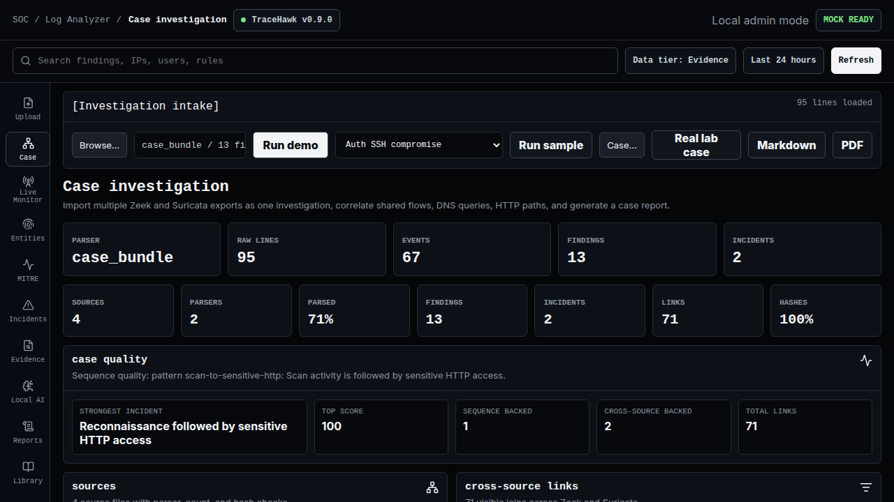

# Multi-Source Incident Case Study

## Question

Can TraceHawk connect sanitized Zeek and Suricata exports into one explainable incident without
using an LLM as a detector?

## Inputs

The public lab sample contains four independent, sanitized engine exports:

- Zeek `conn.log`;
- Zeek `dns.log`;
- Zeek `http.log`;
- Suricata `eve.json`.

The bundle has 95 raw lines. TraceHawk parses 67 events with two parser families, records SHA-256
source and evidence hashes, and preserves the 28 Zeek metadata/header lines as raw evidence rather
than misclassifying them as events.

## Result

| Measure | Result |
| --- | ---: |
| Sources | 4 |
| Parsed events | 67 |
| Findings | 13 |
| Incidents | 2 |
| Cross-source links | 71 |
| Strongest score | 100 |
| Source hashes present | 100% |



The strongest incident joins twelve findings around `10.20.0.25`, the DNS resolver, and the lab web
server. Its score is driven by deterministic behavior sequences, a short time window, multiple
rule families, and correlation pairs retained in the incident rationale.

Cross-source correlation independently matches shared flows, DNS query names, and HTTP paths such
as `/.env`, `/wp-config.php`, `/admin`, and `/backup.zip`. Each link retains both source event IDs
and raw line IDs for side-by-side evidence review.

## Analyst Deliverables

- [HTML incident report](assets/reports/tracehawk-sample-incident.html)
- [PDF incident report](assets/reports/tracehawk-sample-incident.pdf)
- [artifact checksums](assets/manifest.json)

## What This Does Not Prove

The lab is sanitized and intentionally seeded with correlated activity. It proves deterministic
multi-source behavior and traceable evidence, not population-level detection accuracy. The
separate IoT-23 report retains both scan errors and the low-precision stable-endpoint C2-indicator
result instead of claiming production accuracy.

## Reproduce

```bash
make verify-all
```

In the UI, click **Real lab case**, inspect **Case**, then open **Reports**.
