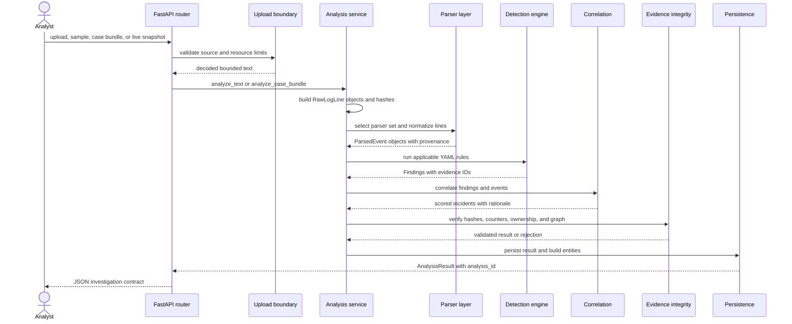

# Event-Processing Pipeline

> Audience: backend engineers, detection engineers, and technical reviewers
> Canonical for: the path from untrusted input to `AnalysisResult`
> Verified against: TraceHawk v0.10.0

This document explains how TraceHawk turns bounded input into deterministic findings, incidents,
entities, and evidence. Source-specific field mappings belong in the ingest guides; YAML syntax and
incident scoring belong in [rule authoring](rule-authoring.md) and
[correlation](correlation.md).

## End-To-End Flow



## Stage 1: Request And Source Validation

HTTP uploads enter through `routers/analyze.py` and `services/uploads.py`. The boundary checks the
configured extension, byte count, UTF-8 decoding, line count, per-file limit, case file count, and
total bundle size. Middleware and authorization apply rate and role boundaries.

Live file, folder, Docker, and interface paths use WebSocket routers and the live service. Their
rolling raw/event windows are capped by `TRACEHAWK_LIVE_MAX_RAW_LINES` and
`TRACEHAWK_LIVE_MAX_EVENTS`; total, retained, and dropped counters remain explicit. The opt-in
syslog process enforces line, queue, TCP connection, idle-timeout, and batch boundaries before
feeding accepted batches into this same analysis and persistence model.

Failure behavior:

- unsupported or malformed input returns a bounded client error;
- rejected input is not persisted as an analysis;
- a failed request must not poison the following analysis;
- unauthorized HTTP and WebSocket operations fail before source access.

## Stage 2: Raw Evidence Construction

`services/ingest.py` splits non-empty input into `RawLogLine` objects. Each line receives:

- a stable source-scoped ID;
- original line number;
- unchanged raw text;
- observation timestamp;
- SHA-256 content hash.

The original uploaded file is not retained as a file. Raw line text may be persisted later so that a
saved finding remains reviewable. This distinction is canonical in the
[persistence lifecycle](persistence-evidence-lifecycle.md).

## Stage 3: Parser Selection

`services/parser_registry.py` provides ordered parser implementations. `services/analysis.py`
selects parsers by behavior rather than by filename alone:

1. take a stratified sample across the input;
2. ask each parser whether it can parse each sampled line;
3. rank matches by parser specificity;
4. suppress weak generic fallback matches when a specific parser dominates;
5. select one parser or a mixed parser set.

Specific formats such as Suricata, Zeek, CloudTrail, Kubernetes, and Windows outrank generic JSON
or syslog fallbacks. This prevents valid vendor records from being accepted by a generic parser and
losing security-specific fields.

Mixed line-oriented files are routed per line. Stateful CSV and Zeek TSV parsing retain their active
header context; arbitrary headerless interleaving remains unsupported.

Every parsed event receives `_tracehawk_parser` in normalized fields so provenance survives mixed
routing.

## Stage 4: Normalization

Every parser produces the shared `ParsedEvent` model:

| Shared field | Meaning |
| --- | --- |
| `id` | Stable event identifier |
| `source_id` | Source provenance |
| `raw_line_id` | Direct link to raw evidence |
| `event_time` | Parsed event time when available |
| `event_type` | Normalized behavior category |
| `host`, `service` | Common infrastructure context |
| `source_ip`, `username` | Common investigation entities |
| `message` | Human-readable normalized description |
| `normalized_fields` | Parser-specific structured values plus provenance |

Parsers may skip metadata headers or invalid records rather than inventing events. Raw evidence and
parsed event counts therefore do not always match.

## Stage 5: Rule Loading And Scoping

`services/rules.py` loads versioned YAML files from `packages/rules/` and validates them against
Pydantic rule models. `services/correlation_patterns.py` also loads the versioned
`packages/correlation/patterns.yml` document and rejects patterns whose behavior tags are not
declared by any rule. Readiness requires both libraries to validate. Detection is scoped by parser:
only rules whose `log_types` include the event's parser family run against those events.

This prevents a similarly named field from an unrelated format from triggering a rule outside its
declared context.

## Stage 6: Deterministic Detection

`services/detection.py` dispatches validated rules to explicit evaluators:

- threshold count in a time window;
- distinct-value cardinality;
- periodic interval and jitter;
- field equality, membership, or substring matching;
- two-to-eight-step typed sequences.

Matching events are grouped by declared fields, sorted by event time, and evaluated within bounded
windows. A `Finding` includes rule identity, severity, confidence, reason, MITRE context, first and
last seen times, event count, and raw evidence IDs.

The detection engine does not call an LLM. AI output cannot enter this stage.

## Stage 7: Evidence Projection

The analysis service resolves finding evidence IDs back to raw lines and returns only relevant
evidence in the single-analysis result. Case analysis also retains source summaries and evidence
needed for cross-source links.

Evidence hashes support integrity comparison; they do not prove external chain of custody or that
the source system itself was trustworthy.

## Stage 8: Correlation And Case Links

`services/correlation.py` groups findings only while the whole group retains a common configured
entity and stays inside the strictest rule's maximum gap. It then evaluates ordered behavior
patterns, time proximity, declared rule-family diversity, and evidence-linked cross-source
corroboration. No rule ID or title fragment controls behavior. The service emits incidents with
additive score components, matched pattern IDs, and human-readable rationale.

Case bundles additionally match compatible Zeek and Suricata observations by flow, DNS query, or
HTTP path within bounded time windows. Each link retains both event IDs and both raw line IDs.

The [correlation document](correlation.md) owns scoring semantics. The
[case workflow](case-investigation-workflow.md) owns the analyst interaction.

## Stage 9: Entity Construction And Persistence

Before a transaction, the server recomputes every unpurged raw-line digest and validates counters,
unique IDs, ownership, event/evidence/finding references, incidents, and cross-source links. A live
snapshot also needs a valid current-process HMAC before this graph check. Validation finishes before
an existing analysis is replaced.

The persistence service then stores the analysis, raw evidence, normalized events, findings,
incidents, and derived entities in one transaction. Saved analyses receive an `analysis_id` and can
be reopened through the API. Notes, settings, retention operations, and audit events use related
tables.

## Stage 10: Presentation, Reports, And Optional AI

The API returns `AnalysisResult`, which the React workspace projects into incident, finding,
evidence, case, entity, MITRE, rule-library, assistant, and report views.

Report generation consumes already structured findings and evidence. Optional local AI receives a
bounded prompt derived from the selected incident, findings, and evidence. It returns advisory text,
never a replacement `AnalysisResult`.

## Worked Example

For the committed SSH sample:

```text
ssh-bruteforce.log
→ validated text
→ 12 RawLogLine objects with hashes
→ linux_auth parser
→ 12 normalized events
→ parser-scoped SSH and sudo rules
→ evidence-backed findings
→ one correlated credential-compromise incident
→ persisted analysis and entities
→ incident/evidence views and exportable report
```

The exact expected counts are asserted in `apps/api/tests/test_analyze_api.py`; the example is not a
population-level accuracy claim.

## Implementation And Verification Map

| Stage | Implementation | Primary verification |
| --- | --- | --- |
| Upload boundary | `routers/analyze.py`, `services/uploads.py`, `security.py` | `test_upload_security.py`, `test_robustness.py` |
| Raw evidence | `services/ingest.py` | parser pipeline tests |
| Parser registry and selection | `services/parser_registry.py`, `services/analysis.py` | `test_parser_selection.py` |
| Source parsers | `services/*_parser.py` | parser-specific tests and scenarios |
| Rule loading | `services/rules.py`, `packages/rules/` | `test_detection_quality.py`, `test_scenarios.py` |
| Detection | `services/detection.py` | `test_sequence_engine.py`, pipeline tests |
| Correlation | `services/correlation.py`, `services/case_bundle.py` | `test_correlation_scoring.py`, `test_case_bundle_api.py` |
| Evidence integrity | `services/evidence_integrity.py`, `services/live_attestation.py` | `test_persistence_integrity.py`, live API tests |
| Persistence | `services/persistence.py`, `database.py` | `test_analyze_api.py` |
| Reports | `services/reports/` | `test_reports_api.py`, `test_case_bundle_api.py` |
| Optional assistant | `services/llm.py` | `test_assistant_api.py` |

## Security Invariants

- No unbounded upload reaches parsing.
- No unsupported parser silently invents a successful analysis.
- Every event preserves source and raw-line provenance.
- Every finding is deterministic and evidence-backed.
- Generic fallback parsers cannot outrank a valid specific parser.
- LLM availability cannot change detection output.
- Rejected input does not create partial persisted investigation state.

## Limitations

- Parsing is in-process and memory-bounded rather than streaming into a distributed store.
- Stateful formats require their headers and cannot be arbitrarily interleaved.
- Timestamp coverage is conservative and vendor coverage is intentionally limited.
- Hashes protect comparison, not source authenticity or legal chain of custody.
- Detection rules are heuristic and external evaluation remains narrow.
