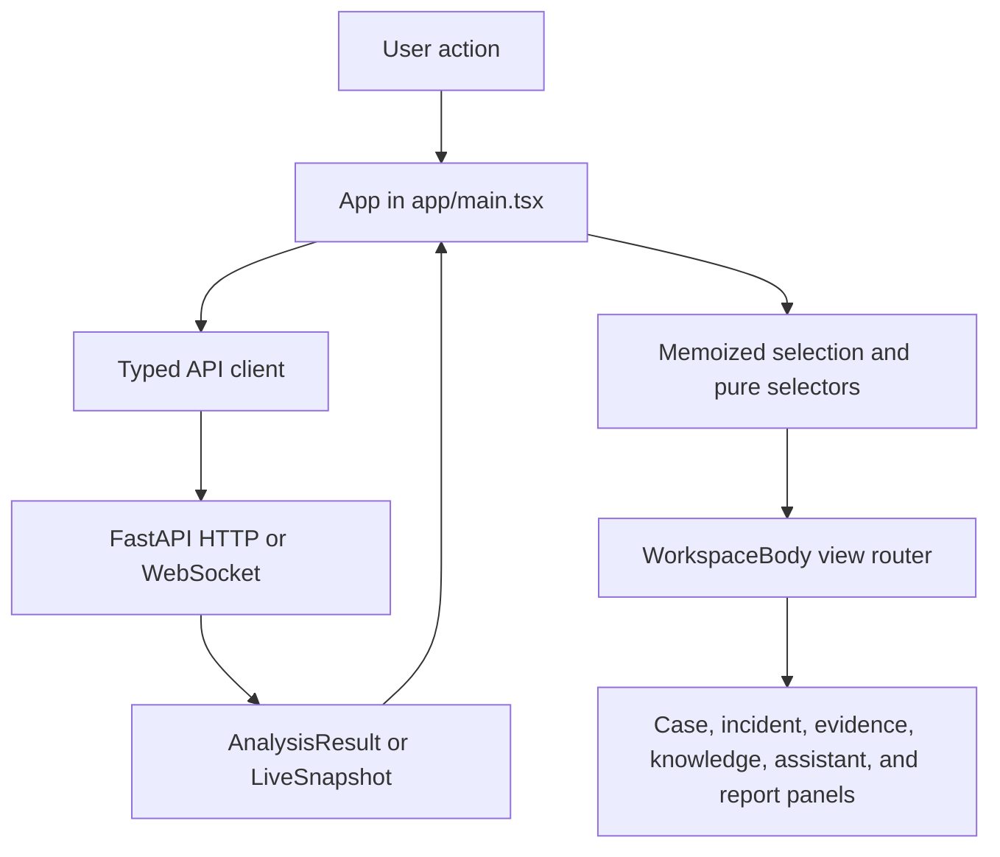
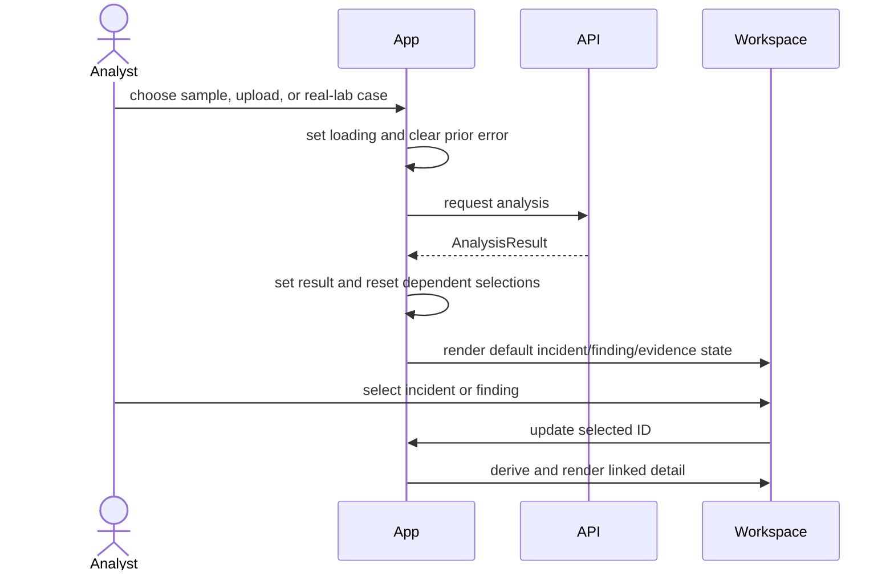

# Frontend Architecture

> Audience: frontend engineers, full-stack reviewers, and accessibility reviewers
> Canonical for: React workspace state, derived views, API integration, and UI verification
> Verified against: TraceHawk v0.9.0

TraceHawk's React application is an investigation workspace, not a generic metrics dashboard. It
keeps the current analysis and analyst selection in one top-level workspace, then projects that
state into focused case, incident, evidence, entity, MITRE, rule, assistant, live, and report views.

## Component And Data Flow



## Source Layout

| Location | Responsibility |
| --- | --- |
| `app/main.tsx` | Top-level state, auth/status loading, analysis actions, navigation, and layout |
| `app/workspaceTypes.ts` | Workspace view and report-format types |
| `app/workspaceOptions.ts` | Sample choices and approved capture presets |
| `generated/openapi.json`, `generated/api-schema.ts` | Backend-derived OpenAPI snapshot and TypeScript component declarations |
| `lib/api.ts` | Generated contract aliases, request helpers, and explicit auth/live envelope types |
| `features/workspace/WorkspaceBody.tsx` | Maps active view to the relevant panel composition |
| `features/workspace/workspaceSelectors.ts` | Pure MITRE, case, timeline, formatting, and report helpers |
| `features/workspace/IncidentPanels.tsx` | Incident list/detail, score rationale, notes, findings, timeline |
| `features/workspace/EvidencePanels.tsx` | Finding-to-evidence review and metadata |
| `features/workspace/CasePanels.tsx` | Source health, cross-source links, case metrics, case timeline |
| `features/workspace/KnowledgePanels.tsx` | Entities, MITRE groups, and rule library |
| `features/workspace/LiveMonitor.tsx` | WebSocket source control, snapshots, pause/resume, save flow |
| `features/workspace/AssistantPanels.tsx` | Local assistant status, settings, prompt preview, explanation |
| `features/workspace/ReportPanel.tsx` | Format selection, redaction, preview, and download |
| `features/workspace/WorkspacePrimitives.tsx` | Small shared visual primitives |
| `styles/main.css` | Application layout, typography, responsive states, severity styling |

## Top-Level Workspace State

`App` owns the state that must remain coordinated across views:

- active workspace view;
- current `AnalysisResult`;
- selected incident and finding IDs;
- assistant status and current response;
- authentication status;
- report format and current report;
- selected built-in sample and rule;
- latest live snapshot;
- search query;
- analysis loading and global error state.

Selected incident and finding objects are derived from IDs and the current result. When a new
analysis arrives, the app resets dependent selections so stale IDs do not point into the previous
investigation.

Local panel state stays near the panel when it does not coordinate the workspace: note drafts,
library filters, selected case links, live capture form values, assistant questions, and report
redaction controls.

## View Routing

The application does not use URL routing for every panel. `WorkspaceBody` selects the current view
from the workspace state and composes the required panels:

```text
upload/live/default → incident overview + findings + evidence
incidents           → incident list + incident detail and notes
evidence            → evidence-focused review
case                → source/cross-source case analysis
entities            → entity inventory
mitre               → grouped ATT&CK context
library             → rule learning and current-case filter
assistant           → evidence-bounded explanation
reports             → Markdown/HTML/PDF generation
settings            → assistant and runtime settings
```

This is appropriate for the current single-workspace application. Shareable deep links and browser
history would require explicit route design later.

## API Boundary

FastAPI Pydantic models are exported to deterministic OpenAPI and TypeScript artifacts. `lib/api.ts`
imports those generated component types, resolves server-filled defaults for browser use, and
centralizes fetch behavior. Production mode uses a same-origin API unless `VITE_API_BASE_URL` is
configured; development can call the local FastAPI port. The complete workflow is documented in
the [generated API contract guide](api-contract.md).

The client treats non-success responses as errors and does not infer findings locally. Security
decisions, authorization, parsing, detections, persistence, and report content remain server-side.

Important contract families are:

- `AnalysisResult`, findings, incidents, evidence, entities, and case links;
- authentication and assistant status/settings;
- analyst notes;
- rule library;
- reports and redaction options;
- live WebSocket snapshots.

The drift check runs locally and in both CI systems. Generated TypeScript provides build-time
checking but is not runtime validation of an untrusted server. The deployment assumes the bundled
UI talks to its matching backend version.

## Analysis Interaction Flow



Finding evidence is filtered by evidence IDs rather than text similarity. This preserves the
backend's deterministic link between result and raw lines.

## Live Monitoring Flow

`LiveMonitor` owns a WebSocket connection and source form state. It supports bounded file or
approved interface modes in the current UI, receives snapshots, and converts a snapshot into the
shared `AnalysisResult` shape for workspace display. Saving is an explicit API action; merely
viewing live updates does not imply durable storage.

Pause and resume messages control the source stream. Connection and source status are distinct so a
connected socket can still report a paused or source-error state.

## Derived Views

Pure functions in `workspaceSelectors.ts` handle transformations that should not perform I/O:

- MITRE groups and severity aggregation;
- cross-source link grouping and labels;
- case metrics and source hash coverage;
- combined event/link case timelines;
- safe display conversion and time formatting;
- report content conversion helpers.

Keeping these transformations pure makes them deterministic and easy to test. It does not replace
component interaction tests.

## Reports And Assistant

The report panel sends the selected incident, findings, and evidence to server-side report
renderers. Redaction is an explicit report option and does not change stored evidence.

The assistant panel displays server-reported provider/model status, builds a request around the
selected incident, and presents advisory output separately from deterministic findings. The
[LLM privacy model](llm-privacy-model.md) owns the product AI boundary.

## Error, Empty, And Loading States

- Top-level analysis actions share loading and error state in `App`.
- Panels that perform independent requests maintain local loading/error state.
- Empty views explain which input or selection is required.
- Live monitoring distinguishes idle, connecting, connected, active, paused, and error states.
- Authentication status is loaded independently of analysis state.

Errors are displayed to the analyst but do not create local substitute results.

## Accessibility And Visual Semantics

The workspace uses semantic controls, visible focus behavior, text labels, and severity colors that
carry meaning without replacing text. Monospace typography is reserved for evidence and operational
metadata; longer analyst content remains readable.

Accessibility checks cover the main workspace plus incident, evidence, metrics, settings, live, and
case states. `/` focuses global search and `Escape` clears and exits it. Exhaustive responsive,
screen-reader, and cross-browser coverage remains a documented gap.

## Implementation And Verification Map

| Concern | Implementation | Verification |
| --- | --- | --- |
| View composition | `WorkspaceBody.tsx` | `WorkspaceBody.test.tsx` |
| Pure derived state | `workspaceSelectors.ts` | `workspaceSelectors.test.ts` |
| Type/API compatibility | generated contract plus `lib/api.ts` | deterministic drift test and TypeScript production build |
| Analysis intake and navigation | `app/main.tsx` | Playwright browser E2E, component tests, backend API tests |
| Incident and notes workflow | `IncidentPanels.tsx` | backend note/auth tests; manual/UI proof |
| Case evidence links | `CasePanels.tsx` | selector tests, case API tests, UI proof |
| Live snapshots | `LiveMonitor.tsx` | backend live authorization tests and component coverage |
| Reports | `ReportPanel.tsx` | backend report tests, component tests, Playwright E2E |
| Assistant | `AssistantPanels.tsx` | backend assistant tests and targeted component coverage |

Run:

```bash
npm --prefix apps/web run test:coverage
npm --prefix apps/web run build
make smoke-ui
```

## Current Testing Gap

Frontend coverage includes all maintained source files and enforces 70% lines/statements, 65%
functions, and 50% branches. Thirty-one behavior tests cover the main intake, incidents, notes,
evidence, case correlation, reports, assistant/settings, rule filters, live retention, rejected
snapshot recovery, keyboard search, empty states, and selected axe states. Five Playwright Chromium
tests exercise the built application across demo/report, real-lab case, evidence pivot, admin
navigation, and a rejected action with retry.

The remaining gaps are cross-browser coverage, every responsive state, exhaustive screen-reader
behavior, URL-addressable workspace state, and broader tests for secondary error branches. The
current percentages are meaningful enforced floors, not a claim of exhaustive UI correctness.

## Limitations

- Top-level state is centralized in one component and will become harder to evolve as workflows grow.
- View state is not represented by shareable URLs.
- Generated types do not perform runtime validation of a compromised or mismatched backend response.
- The current UI is optimized for one active investigation, not multi-case collaboration.
- Accessibility and responsive behavior need broader automated verification.
