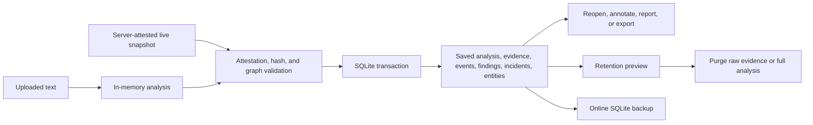
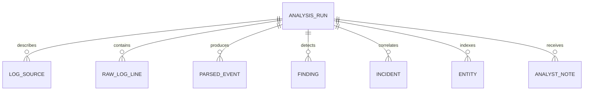

# Persistence And Evidence Lifecycle

> Audience: backend engineers, security reviewers, privacy reviewers, and operators
> Canonical for: stored investigation state, evidence provenance, retention, and recovery
> Verified against: TraceHawk v0.10.0

TraceHawk uses SQLite to reopen bounded local investigations without retaining the original uploaded
file as a file. It does persist selected investigation state, including raw evidence text required
to explain saved findings and case links. This is sensitive local data and must not be confused with
stateless upload processing.

## Lifecycle Summary



## What Is And Is Not Retained

| Data | Retained | Notes |
| --- | --- | --- |
| Original uploaded file | No | TraceHawk does not copy the file into durable upload storage |
| Raw evidence line text | Yes | Required to reopen evidence and generate reports |
| Raw line SHA-256 | Yes | Supports integrity comparison |
| Normalized events | Yes | Includes parser-specific normalized fields |
| Findings and incidents | Yes | Includes evidence IDs, scores, and context |
| Entities | Yes | Derived index for investigation navigation |
| Analyst notes | Yes | Scoped to analysis and incident |
| Assistant prompt/response history | No general conversation store | Current responses are request-scoped unless represented elsewhere by the user |
| Application settings | Yes | Stored as bounded JSON values |
| Audit events | Yes | Body-free request and authorization metadata |

The authenticated private workspace must receive sanitized input only. Not retaining the original
file does not make persisted raw line text non-sensitive.

The separate `public_demo` profile is the explicit exception to this table: it does not initialize
SQLite and does not retain raw lines, events, findings, incidents, entities, reports, settings, or
audit records. Its result exists only in the HTTP response and browser React memory. This exception
does not change the private analysis routes, which continue to persist investigation evidence.

## Data Model



Global application settings and audit events are stored independently of a single analysis.
Foreign-key columns express ownership, while several relationship lists such as finding IDs and
incident IDs are stored as JSON because this is a bounded single-instance model rather than a
general analytics warehouse.

## Record Responsibilities

| Record | Responsibility |
| --- | --- |
| `AnalysisRunRecord` | Analysis identity, parser, counts, filename, creation time, and integrity summary |
| `LogSourceRecord` | Source name, type, parser, and status |
| `RawLogLineRecord` | Original evidence text, line number, hash, and source |
| `ParsedEventRecord` | Normalized event fields and raw-line link |
| `FindingRecord` | Rule result, MITRE mapping, time range, and evidence IDs |
| `IncidentRecord` | Grouped finding IDs, entities, timeline, score, and status |
| `EntityRecord` | Derived IP/user/host/service/path/domain/container index |
| `AnalystNoteRecord` | Human observation, decision, follow-up, or false-positive note |
| `AppSettingRecord` | Retention and assistant configuration |
| `AuditEventRecord` | Actor, role, path, action, outcome, and request ID without request body |

The SQLAlchemy schema is defined in `apps/api/tracehawk_api/database.py`. Alembic revisions under
`apps/api/migrations/` initialize and evolve that schema. A pre-Alembic database that already has
the complete v0.7.1 schema is recognized column by column, adopted at the baseline revision, and
upgraded without deleting records. The `0003_evidence_integrity` revision adds the persisted
integrity summary; recognized v0.8.0 schemas are adopted at `0002_case_integrity` before that
revision is applied. Partial or unknown unversioned schemas are rejected.
Conversion between domain models and database records is in `services/persistence.py`.

## Schema Migration Lifecycle

Application startup upgrades the configured database to Alembic `head`. The migration call is
serialized in-process and cached for the active engine, so normal request dependencies do not run a
new migration after startup has completed.

Before upgrading a retained database:

1. stop concurrent writers and keep the single-replica boundary;
2. create and verify an online SQLite backup;
3. run the application upgrade or `alembic -c apps/api/alembic.ini upgrade head`;
4. verify readiness and reopen a saved investigation;
5. retain the backup until the upgraded revision is accepted.

The baseline downgrade is intentionally destructive because it removes the baseline schema. It is
tested as a structural round trip, not advertised as a data-preserving production rollback. Restore
the pre-upgrade backup when retained evidence must survive a rollback.

## Analysis Identity And Write Behavior

An analysis ID is derived from filename and source identity unless an explicit case ID is supplied.
`persist_analysis` merges the run and its related records, derives entities, and commits the
transaction. The returned `AnalysisResult` receives the durable `analysis_id`.

The current design favors deterministic demo and local workflow behavior. It is not a versioned
event-sourcing model: reprocessing the same identity can merge current records rather than retain an
immutable history of every computation.

## Evidence Provenance

Traceability relies on linked identifiers:

```text
AnalysisRun
→ ParsedEvent.raw_line_id
→ RawLogLine.id + content_hash + raw_text

Finding
→ evidence_line_ids[]
→ RawLogLine records

CrossSourceLink
→ source and target event IDs
→ source and target raw line IDs
```

SHA-256 detects content changes when the same evidence is compared later. It does not establish who
collected the source, whether the source host was trustworthy, or a legal chain of custody.

Before persistence, `services/evidence_integrity.py` recomputes every unpurged raw-line digest and
validates counters, unique IDs, source ownership, event-to-raw references, finding evidence,
incident findings, and cross-source links. Validation runs before existing child records are
deleted, so a rejected replacement leaves the last committed analysis intact.

Live snapshots have an additional boundary. The backend signs the canonical snapshot projection
with a process-local HMAC before sending it over the WebSocket. The save endpoint verifies that
attestation before namespacing or writing the snapshot, then performs the same independent SHA-256
and graph validation. The HMAC proves that the submitted snapshot matches one emitted by the
current backend process. It does not prove sensor identity or survive a process restart.

## Read Paths

The persistence service supports:

- listing recent analysis summaries;
- reopening a complete `AnalysisResult`;
- listing incidents globally or by analysis;
- listing and resolving entities;
- reading and changing analyst notes;
- exporting analysis state before retention;
- producing reports from reopened evidence.

Read ordering is explicit so incident priority, timelines, evidence lines, and entity risk remain
stable for the UI.

## Retention

Retention is a deliberate operation with preview and apply stages. Current modes can remove full
analyses or purge raw evidence while keeping higher-level findings, depending on the saved setting.

Before applying retention:

1. inspect the preview counts and affected analysis IDs;
2. export the analysis if it must be preserved;
3. create a verified SQLite backup when recovery is required;
4. apply the selected mode;
5. verify that the remaining detail matches the chosen policy.

Purging raw lines makes exact evidence unavailable even if findings remain. Reports generated after
that operation cannot recreate deleted raw text.

The purge operation retains the original SHA-256 value as a one-way commitment, replaces the text
with `[PURGED_RAW_LOG]`, and changes the integrity status to `raw_purged`. After that deliberate
transition, the retained hash describes the deleted original rather than the placeholder text.

## Backup And Restore

`services/database_backup.py` and `tools/sqlite_backup.py` use SQLite's online backup mechanism and
integrity checks rather than copying a potentially active database file blindly. The operational
procedure is summarized in [operations](operations.md); the complete source repository also carries
the operator-only backup and restore runbook.

Backups contain sensitive persisted evidence and must receive the same access and retention
protection as the primary database.

## Security And Privacy Invariants

- The original upload is not stored as a durable file.
- Persisted raw text is still sensitive evidence.
- Audit records do not store request bodies or uploaded log content.
- Notes are attributed by the server-side authenticated identity in protected mode.
- Retention changes require the configured privileged role.
- Exports and backups are explicit operations and may outlive database retention.
- Report redaction does not modify the underlying stored evidence.
- Every unpurged persisted raw line is server-verified against its SHA-256 digest before commit.
- Live saves require a valid process-local server attestation in addition to caller authorization.

## Implementation And Verification Map

| Concern | Implementation | Verification |
| --- | --- | --- |
| Schema, migrations, and sessions | `database.py`, `migrations/` | migration, health, and API tests |
| Analysis persistence and reopen | `services/persistence.py` | `test_analyze_api.py` |
| Hash, graph, and live attestation | `services/evidence_integrity.py`, `services/live_attestation.py` | `test_persistence_integrity.py`, live API/WebSocket tests |
| Entities | `services/entities.py`, `persistence.py` | `test_case_bundle_api.py` |
| Notes | `services/notes.py`, `routers/notes.py` | `test_analyze_api.py`, `test_auth_gate.py` |
| Retention preview/apply/export | `services/retention.py` | retention cases in `test_analyze_api.py` |
| Backup | `services/database_backup.py`, `tools/sqlite_backup.py` | `test_sqlite_backup_tool.py` |
| Audit | `services/audit.py`, `routers/audit.py` | `test_auth_gate.py` |
| Report redaction | `services/reports/redaction.py` | report and case-bundle tests |

## Failure Modes

- Disk exhaustion or an unwritable database path makes readiness fail.
- A process crash during a transaction can prevent the current write while SQLite protects committed
  transactions.
- Purged evidence cannot be reconstructed from hashes.
- Backups can expose the same evidence as the live database if copied insecurely.
- JSON relationship lists are not suitable for high-volume analytical joins.
- Multiple replicas would not share the in-process rate limit or safely coordinate one local file.

## Production Gaps

Before broader production use, the persistence layer needs at least:

- field-level transforms beyond the v0.8.0 case-integrity revision;
- a documented immutable-history policy;
- encryption and key-management decisions for stored evidence and backups;
- centralized audit and rate-limit state for multiple replicas;
- tested concurrency, corruption recovery, and disaster-recovery objectives;
- retention enforcement scheduled independently of interactive API calls.
